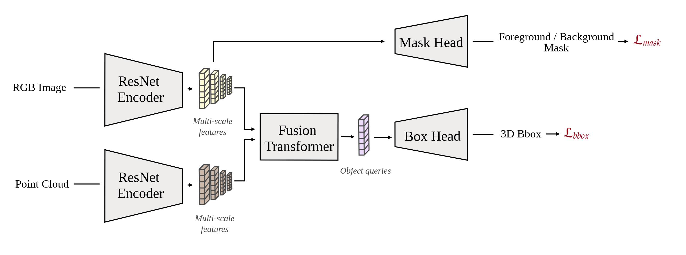

# Vision3D: Monocular 3D Object Detection with Auxiliary Point Cloud Input

**Framework:**  Vision3D is a custom, pure PyTorch-based framework designed for 3D Computer Vision tasks. The framework is modular, extensible, and has all core components for training, evaluation and visualization. Additionally, it supports WandB experiments logging and exporting models to ONNX for deployment.

**MonoDETR3D Model:** Performs 3D object detection from single RGB image and structured Point Cloud (PC).

**Key features:**
- Utilizes two ResNet encoders to extract multi-scale features from RGB images and structured Point Clouds (PC).
- Leverages the `SpatiallyAwareTransformer` to efficiently fuse these modalities using CUDA-optimized Deformable Self-Attention, followed by Cross-Attention modules. Refer to [diagram](./assets/spatially_aware_transformer_diagram.png) for details. 
- Enhances the image encoder by introducing a proxy task that predicts meaningful segmentation masks for regularization.
- The model predicts a fixed number of objects, which are matched to ground truth targets using the Hungarian algorithm.



## Project Structure 
```
vision3d/
├── assets
├── configs                 # Configuration files for models and datasets
├── docs
├── scripts                 # Utility scripts (training, evaluation, ONNX export)
├── vision3d                # Core library
│   ├── datasets
│   ├── engine
│   ├── hooks
│   ├── losses
│   ├── metrics
│   ├── models
│   │   ├── modelling
│   │   │   ├── decoders
│   │   │   ├── encoders
│   │   │   ├── heads
│   │   │   └── utils
│   │   ├── mono_detr3d.py
│   │   ├── ops
│   └── utils

```

## Setup

#### Installation
- For installing environment, please follow these [instructions](./docs/setup.md).

#### Dataset Preparation 
- Convert dataset in required format defined by `scripts/generate_data_splits.py`:
```bash
python scripts/generate_data_splits.py \
    --dataset_root /path/to/dataset \
    --output_dir /path/to/output/processed_dataset \
    --val_ratio 0.2 \
    --test_ratio 0.1 \
    --random_seed 42
```
## Usage 

#### Training
- Create / modify configuration file. Refer to `configs/` for an example.
- Launch training via `scripts/train.py`:
```bash
python scripts/train.py \
    --config /path/to/config.py \
    --save_dir /path/to/save/logs_and_checkpoints \
    --use_wandb
```
#### Evaluation
- Launch `scripts/eval.py`:
```bash
python scripts/eval.py \
    --config /path/to/config.py \
    --checkpoint /path/to/checkpoint.pth \
    --eval_dir /path/to/evaluation/results \
    --split test
```
#### ONNX Export
- Launch `scripts/convert_onnx.py`:
```bash
python convert_onnx.py \
    --config /path/to/config.py \
    --checkpoint /path/to/checkpoint.pth \
    --output_path /path/to/output/model.onnx \
    --device cuda
```
- Once exported, [Netron](https://netron.app/) can be used to visualize the model. Visualization of MonoDETR3D can found [here](./assets/mono_detr3d_onnx.svg). 

#### Data Exploration
- `data_exploration.ipynb` provides interactive visualization of dataset samples.

## License 
This project is licensed under the MIT License. See the LICENSE file for details.

## Acknowledgments
- Thanks to the authors of [MonoDETR](https://github.com/ZrrSkywalker/MonoDETR), from whom we adapted the `VisualEncoder` for our `SpatiallyAwareTransformer` and the custom CUDA implementation of Deformable Attention.
